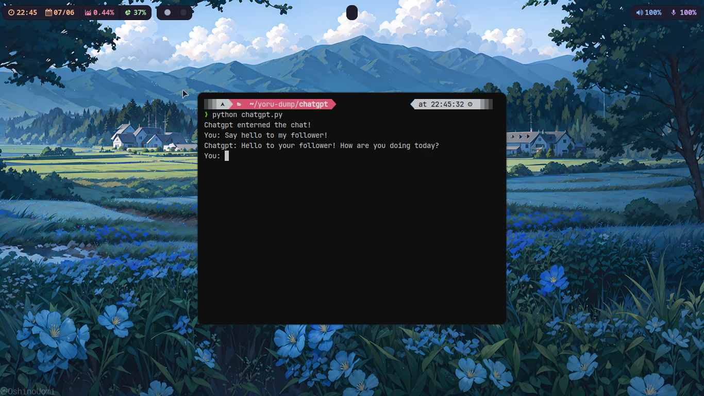
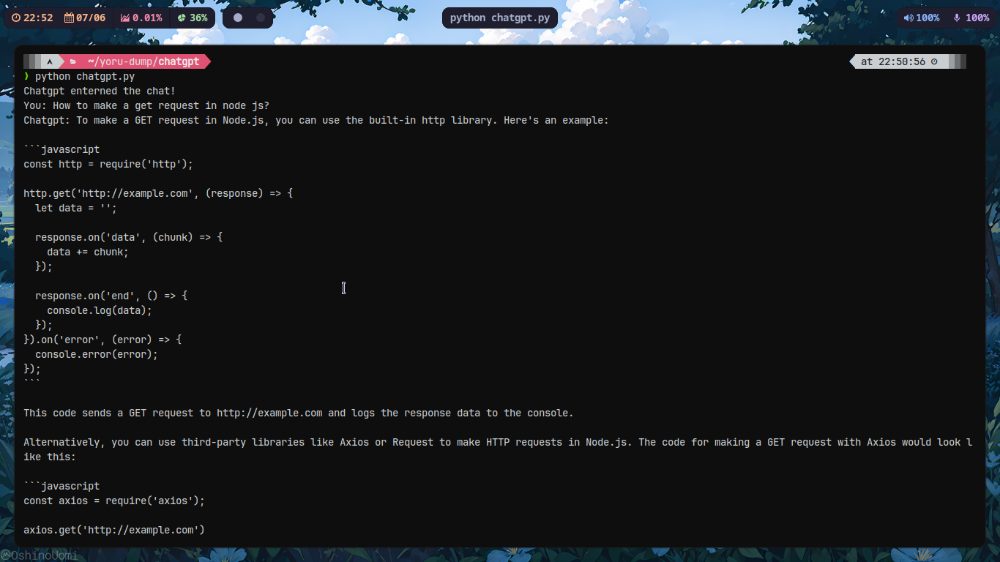

# Chatgpt on Terminal
Through this script you can communicate with [gpt-3.5-turbo](https://platform.openai.com/docs/models/gpt-3-5) model of openAI, not really a hardcore project but its fun you know? tho you can't make many requets because of their [rate limits policy](https://platform.openai.com/docs/guides/rate-limits)

# Dependecies required
`openai`, It is a library by openAI basically a wrappper to work with their api
`python-dotenv`, To work with the environmets variable, which is the apikey for your account provided by openAI
- openai
- python-dotenv

## Installation
```bash
chmod +x install.sh

```
provide executeable permission to make the scipt to run
```bash
./install.sh
```
# Showcase



# openAI
If you want to learn more how this works, you can consider visiting [openAI's](https://platform.openai.com/docs/introduction) documentation.
